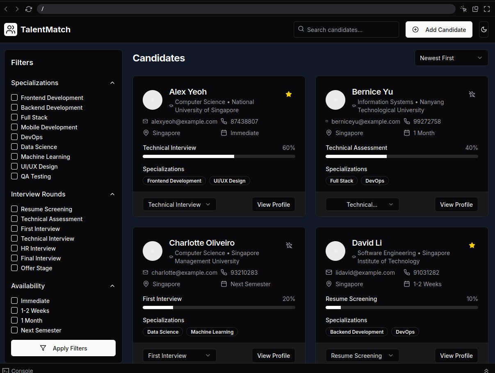
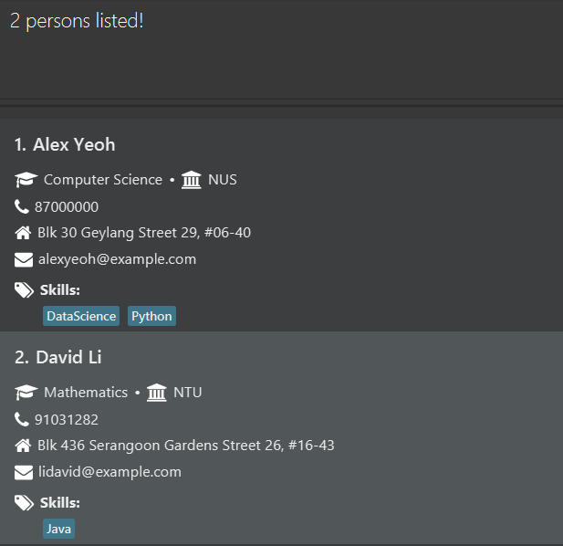

# TalentMatch User Guide

TalentMatch is a **desktop app for managing applicants, optimized for use via a Command Line Interface** (CLI) while still having the benefits of a Graphical User Interface (GUI). If you can type fast, TalentMatch can get your applicant management tasks done faster than traditional GUI apps.

<!-- * Table of Contents -->
<page-nav-print />

--------------------------------------------------------------------------------------------------------------------

## Quick start

1. Ensure you have Java `17` or above installed in your Computer. 
   **Mac users:** Ensure you have the precise JDK version prescribed [here](https://se-education.org/guides/tutorials/javaInstallationMac.html).

1. Download the latest `.jar` file from [here](https://github.com/se-edu/addressbook-level3/releases).

1. Copy the file to the folder you want to use as the _home folder_ for your AddressBook.

1. Open a command terminal, `cd` into the folder you put the jar file in, and use the `java -jar addressbook.jar` command to run the application. 
   A GUI similar to the below should appear in a few seconds. Note how the app contains some sample data. 
   

1. Type the command in the command box and press Enter to execute it. e.g. typing **`help`** and pressing Enter will open the help window. 
   Some example commands you can try:

   * `list` : Lists all contacts.

   * `add n/John Doe p/98765432 e/johnd@example.com a/John street, block 123, #01-01` : Adds a contact named `John Doe` to the Address Book.

   * `delete 3` : Deletes the 3rd contact shown in the current list.

   * `clear` : Deletes all contacts.

   * `exit` : Exits the app.

1. Refer to the [Features](#features) below for details of each command.

--------------------------------------------------------------------------------------------------------------------

## Features

<box type="info" seamless>

**Notes about the command format:** 

* Words in `UPPER_CASE` are the parameters to be supplied by the user. 
  e.g. in `add n/NAME`, `NAME` is a parameter which can be used as `add n/John Doe`.

* Items in square brackets are optional. 
  e.g `n/NAME [t/TAG]` can be used as `n/John Doe t/friend` or as `n/John Doe`.

* Items with `…`​ after them can be used multiple times including zero times. 
  e.g. `[t/TAG]…​` can be used as ` ` (i.e. 0 times), `t/friend`, `t/friend t/family` etc.

* Parameters can be in any order. 
  e.g. if the command specifies `n/NAME p/PHONE_NUMBER`, `p/PHONE_NUMBER n/NAME` is also acceptable.

* Extraneous parameters for commands that do not take in parameters (such as `help`, `list`, `exit` and `clear`) will be ignored. 
  e.g. if the command specifies `help 123`, it will be interpreted as `help`.

* Job commands should be called only in job view while person commands should be called only in person view. This is to ensure users can see real time updates in response to their query.

* If you are using a PDF version of this document, be careful when copying and pasting commands that span multiple lines as space characters surrounding line-breaks may be omitted when copied over to the application.
</box>

### Viewing help : `help`

Shows a message explaning how to access the help page.

Format: `help`

### Switching views : `switchview`

Switches the view of GUI from a persons list to a jobs list

Format: `switchview
`
### Adding a person/job/application

#### Adding a person: `add`
Adds a person to TalentMatch.

Format: `add n/NAME s/SCHOOL d/DEGREE p/PHONE_NUMBER e/EMAIL a/ADDRESS [t/TAG]…​`

<box type="tip" seamless>

**Tip:** A person can have any number of tags (including 0)
</box>

Examples:
* `add n/John Doe s/NUS d/Computer Science p/98765432 e/johnd@example.com a/John street, block 123, #01-01`
* `add n/Betsy Crowe s/NTU d/Civil Engineering t/friend e/betsycrowe@example.com a/Newgate Prison p/1234567 t/criminal`

--- 

#### Adding a job: `addjob`
Adds a job to TalentMatch

Format: `addjob jt/JOB_TITLE jr/INTERVIEW_ROUNDS js/JOB_SKILLS ja/JOB_ADDRESS em/JOB_TYPE`

Examples:
* `addjob jt/Software Engineering jr/3 js/Python React ja/1 Fusionopolis Place, Galaxis, Singapore 138522 em/Intern`

---

#### Adding an application: `addapp`
Adds an application to TalentMatch

Format: `addapp p/PHONE_NUMBER jt/JOB_TITLE [as/APPLICATION_STATUS]`

<box type="tip" seamless>

**Tip:** 
* The default application status is 0
* The specified phone number and job title must exist in TalentMatch
</box>

Examples:
* `addapp p/98765432 jt/Software Engineering as/3`

### Listing all persons/jobs 

#### Listing all persons: `list`

Shows a list of all persons in TalentMatch.

Format: `list`

---

#### Listing all jobs: `listjob`

Shows a list of all jobs in TalentMatch.

Format: `listjob`

### Editing a person/job

#### Editing a person: `edit`

Edits an existing person in TalentMatch.

Format: `edit INDEX [n/NAME] [s/SCHOOL] [d/DEGREE] [p/PHONE] [e/EMAIL] [a/ADDRESS] [t/TAG]…​`

* Edits the person at the specified `INDEX`. The index refers to the index number shown in the displayed person list. The index **must be a positive integer** 1, 2, 3, …​
* At least one of the optional fields must be provided.
* Existing values will be updated to the input values.
* When editing tags, the existing tags of the person will be removed i.e adding of tags is not cumulative.
* You can remove all the person's tags by typing `t/` without
    specifying any tags after it.

Examples:
*  `edit 1 p/91234567 e/johndoe@example.com` Edits the phone number and email address of the 1st person to be `91234567` and `johndoe@example.com` respectively.
*  `edit 2 n/Betsy Crower t/` Edits the name of the 2nd person to be `Betsy Crower` and clears all existing tags.

---

#### Editing a job: `editjob`

Edits an existing job in TalentMatch.

Format: `editjob INDEX [jt/JOB_TITLE] [jr/INTERVIEW_ROUNDS] [js/JOB_SKILLS] [ja/JOB_ADDRESS] [em/JOB_TYPE]` 

* Edits the job at the specified `INDEX`. The index refers to the index number shown in the displayed job list. The index **must be a positive integer** 1, 2, 3, …​
* At least one of the optional fields must be provided.
* Existing values will be updated to the input values.
* When editing job skills, the existing skills of the person will be removed i.e adding of skills is not cumulative.
* You can remove all the job's skills by typing `js/` without
  specifying any skills after it.

Examples:
*  `editjob 7 jt/Software Engineering jr/3 [js/Python React ja/1 Fusionopolis Place, Galaxis, Singapore 138522 em/Intern`

### Locating persons/jobs/applications:

#### Locating persons: `find`

Finds persons whose details contain any of the given keywords.

Format: `find KEYWORD [MORE_KEYWORDS]`

* The search is case-insensitive. e.g `hans` will match `Hans`
* The order of the keywords does not matter. e.g. `Hans Bo` will match `Bo Hans`
* Only full words will be matched e.g. `Han` will not match `Hans`
* Persons matching at least one keyword will be returned (i.e. `OR` search).
  e.g. `Hans Bo` will return `Hans Gruber`, `Bo Yang`

Examples:
* `find John` returns `john` and `John Doe`
* `find alex david` returns `Alex Yeoh`, `David Li` 
  

---

#### Locating jobs: `findjob`

Finds jobs whose details contain any of the given keywords.

Format: `findjob KEYWORD [MORE_KEYWORDS]`

* The search is case-insensitive. e.g `software` will match `Software`
* The order of the keywords does not matter. e.g. `Engineering Software` will match `Software Engineering`
* Only full words will be matched e.g. `Engi` will not match `Engineer`
* Jobs matching at least one keyword will be returned (i.e. `OR` search).
  e.g. `Engineer` will return `Software Engineer`, `AI Engineer`

Examples:
* `findjob Software` returns `Software Engineering`

---

#### Locating application: `findapp`

Finds application whose details contain both keywords.

Format: `findapp p/PHONE_NUMBER jt/JOB_TITLE`

* The search is case-insensitive. e.g `software` will match `Software`
* Only full words will be matched e.g. `Engi` will not match `Engineer`
* Matching application will be found, else return a NOT_FOUND_MESSAGE

Examples:
* `findapp p/98765432 jt/Software Engineering` returns `Software Engineering`

### Deleting a person/job/application 

#### Deleting a person: `delete`

Deletes the specified person from TalentMatch.

Format: `delete INDEX`

* Deletes the person at the specified `INDEX`.
* The index refers to the index number shown in the displayed person list.
* The index **must be a positive integer** 1, 2, 3, …​

Examples:
* `list` followed by `delete 2` deletes the 2nd person in TalentMatch.
* `find Betsy` followed by `delete 1` deletes the 1st person in the results of the `find` command.

---

#### Deleting a job: `deletejob`

Deletes the specified job from TalentMatch.

Format: `deletejob INDEX`

* Deletes the job at the specified `INDEX`.
* The index refers to the index number shown in the displayed job list.
* The index **must be a positive integer** 1, 2, 3, …​

Examples:
* `listjob` followed by `deletejob 2` deletes the 2nd job in TalentMatch.
* `findjob Software Engineering` followed by `delete 1` deletes the 1st job in the results of the `find` command.

---

#### Deleting an application: `delapp`

Deletes the specified application from TalentMatch.

Format: `delapp p/PHONE_NUMBER jt/JOB_TITLE`

* Deletes the application with the specified `PHONE_NUMBER` and `JOB_TITLE`.

Examples:
* `delapp p/98765432 jt/Software Engineering` deletes the application linked to applicant with phone 98765432 
applying for Software Engineering role.

### Advancing applications: `advapp`

Advances an application to the next round of interviews

Format: `advapp p/PHONE_NUMBER jt/JOB_TITLE [as/ROUNDS]`

* Advances the specified application by the specified ROUNDS
* Default rounds would be 1

Examples:
* `advapp p/98765432 jt/Software Engineering as/2`
### Clearing all entries : `clear`

Clears all person entries from TalentMatch.

Format: `clear`

### Exiting the program : `exit`

Exits the program.

Format: `exit`

### Saving the data

TalentMatch data are saved in the hard disk automatically after any command that changes the data. There is no need to save manually.

### Editing the data file

TalentMatch data are saved automatically as a JSON file `[JAR file location]/data/addressbook.json`. Advanced users are welcome to update data directly by editing that data file.

<box type="warning" seamless>

**Caution:**
If your changes to the data file makes its format invalid, AddressBook will discard all data and start with an empty data file at the next run.  Hence, it is recommended to take a backup of the file before editing it. 
Furthermore, certain edits can cause the AddressBook to behave in unexpected ways (e.g., if a value entered is outside the acceptable range). Therefore, edit the data file only if you are confident that you can update it correctly.
</box>

### Archiving data files `[coming in v2.0]`

_Details coming soon ..._

--------------------------------------------------------------------------------------------------------------------

## FAQ

**Q**: How do I transfer my data to another Computer? 
**A**: Install the app in the other computer and overwrite the empty data file it creates with the file that contains the data of your previous AddressBook home folder.

--------------------------------------------------------------------------------------------------------------------

## Known issues

1. **When using multiple screens**, if you move the application to a secondary screen, and later switch to using only the primary screen, the GUI will open off-screen. The remedy is to delete the `preferences.json` file created by the application before running the application again.
2. **If you minimize the Help Window** and then run the `help` command (or use the `Help` menu, or the keyboard shortcut `F1`) again, the original Help Window will remain minimized, and no new Help Window will appear. The remedy is to manually restore the minimized Help Window.

--------------------------------------------------------------------------------------------------------------------

## Command summary

Action     | Format, Examples
-----------|----------------------------------------------------------------------------------------------------------------------------------------------------------------------
**Add**    | `add n/NAME s/SCHOOL d/DEGREE p/PHONE_NUMBER e/EMAIL a/ADDRESS [t/TAG]…​`   e.g., `add n/James Ho s/NUS d/Physics p/22224444 e/jamesho@example.com a/123, Clementi Rd, 1234665 t/friend t/colleague`
**AddJob** | `addjob jt/JOB_TITLE jr/INTERVIEW_ROUNDS js/JOB_SKILLS ja/JOB_ADDRESS em/JOB_TYPE`   e.g., `addjob jt/Software Engineering jr/3 js/Python React ja/1 Fusionopolis Place, Galaxis, Singapore 138522 em/Intern`
**AddApp** | `addapp p/PHONE_NUMBER jt/JOB_TITLE [as/APPLICATION_STATUS]`   e.g., `addapp p/98765432 jt/Software Engineering as/3`
**AdvApp** | `advapp p/PHONE_NUMBER jt/JOB_TITLE [as/ROUNDS]`   e.g., `advapp p/98765432 jt/Software Engineering as/2`
**Clear**  | `clear`
**Delete** | `delete INDEX`  e.g., `delete 3`
**DeleteJob** | `deletejob INDEX`   e.g., `deletejob 3`
**DeleteApp** | `delapp p/PHONE_NUMBER jt/JOB_TITLE`   e.g., `delapp p/98765432 jt/Software Engineering`
**Edit**   | `edit INDEX [n/NAME] [s/SCHOOL] [d/DEGREE] [p/PHONE_NUMBER] [e/EMAIL] [a/ADDRESS] [t/TAG]…​`  e.g.,`edit 2 n/James Lee e/jameslee@example.com`
**EditJob** | `editjob INDEX [jt/JOB_TITLE] [jr/INTERVIEW_ROUNDS] [js/JOB_SKILLS] [ja/JOB_ADDRESS] [em/JOB_TYPE]`   e.g., `editjob 7 jt/Software Engineering jr/3 [js/Python React ja/1 Fusionopolis Place, Galaxis, Singapore 138522 em/Intern`
**Find**   | `find KEYWORD [MORE_KEYWORDS]`  e.g., `find James Jake`
**FindJob** | `findjob KEYWORD [MORE_KEYWORDS]`  e.g., `findjob Software Engineering`
**FindApp** | `findapp p/PHONE_NUMBER jt/JOB_TITLE`   e.g., `findapp p/98765432 jt/Software Engineering`
**List**   | `list`
**ListJobs** | `listjob`
**Help**   | `help`
**SwitchView** | `switchview`
